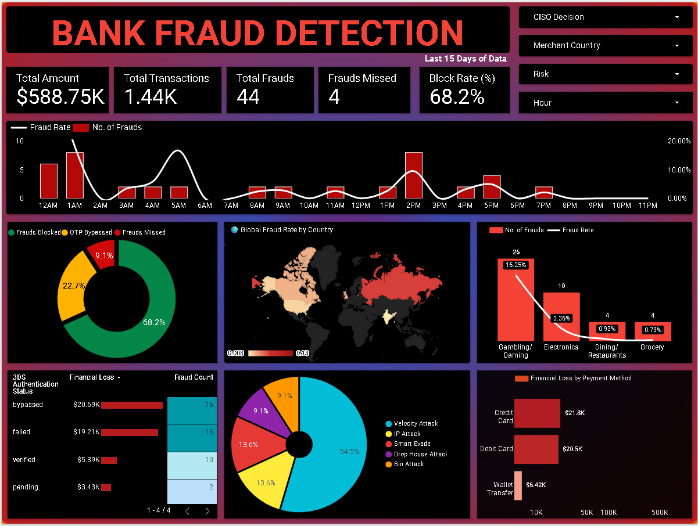
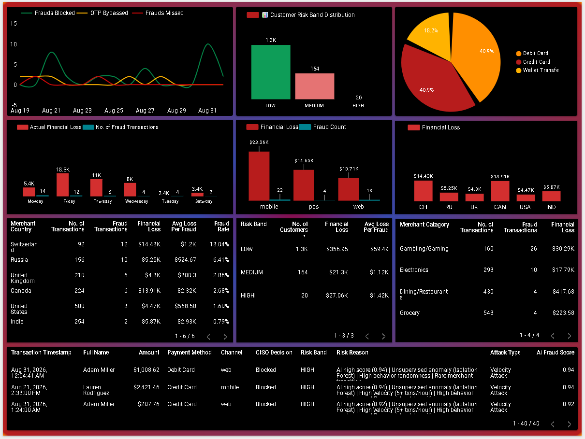

# 🏦 Enterprise Bank Fraud Detection & MLOps Pipeline

**Author:** Sushant Kumar Yadav  
**Domain:** Financial Crime Analytics, MLOps, Data Engineering & Cloud Architecture  

[](https://cloud.google.com/)
[](https://cloud.google.com/bigquery)
[](https://www.python.org/)
[](https://github.com/features/actions)
[](https://lookerstudio.google.com/)
[](https://docs.github.com/en/actions/deployment/security-hardening-your-deployments)

---

## 📑 Executive Summary

Traditional fraud detection relies heavily on static CSV files and manual, rule-based reviews. This project introduces a **Cloud-Native, Fully Automated Fraud Architecture** designed to identify anomalous banking transactions continuously. 

By avoiding heavy data extraction, this pipeline leverages **In-Warehouse Machine Learning (BigQuery ML)** combined with a **Python Forensic Ensemble Engine** (Isolation Forest, Statistical Scoring). Orchestrated securely via **GitHub Actions** using **OIDC Workload Identity Federation (Zero Static Keys)**, the system updates a live Looker Studio Command Center daily, enabling a 100% hands-off threat detection environment.

---

## 📊 CISO Command Center & Business Impact

The pipeline feeds directly into a dark-themed Looker Studio dashboard designed for security analysts, surfacing critical risk metrics for immediate executive action.

<p align="center">
  
  
</p>

*Above: The Live Fraud Analytics Dashboard tracking financial loss, attack vectors, risk band distributions, and automated CISO decisions.*

### 🎯 Key Performance Metrics
* **Automated CISO Decisions:** Re-engineered the decision matrix to eliminate "Manual Reviews." The system now operates strictly on **DEFCON 1 (Critical Block)** and **DEFCON 2 (Require OTP)**, freeing up the fraud team entirely.
* **High-Precision Blocking:** Achieved an automated **68.2% Block Rate** on suspicious activities. Out of 44 actual frauds in the latest holdout set, the engine successfully caught 40 (90.9% overall recall).
* **Threat Diagnostics:** Live tracking of over **$588.75K** in transactional volume across multiple threat vectors including Velocity Attacks, Drop House Networks, and Bin Attacks.
* **Geospatial & Category Risk:** Real-time global heatmaps expose high-risk corridors and merchant-category vulnerabilities (e.g., Gambling/Gaming vs. Electronics).

---

## ⚙️ Technical Architecture (How It Works)

### 1. The Medallion Data Lake (Synthetic Generation)
A custom Python pipeline (`data_pipeline/main.py`) simulates 300K+ transactional records across 5 distinct attack vectors. It features a **Hybrid Engine** capable of handling both *Full Rebuilds* and *Incremental Last-2-Day* processing via `UNIX_SECONDS` window functions, upgrading data progressively through Raw ➔ Silver ➔ Gold layers.

### 2. In-Warehouse ML (First Line of Defense)
An XGBoost Classifier (`sushant_xgboost_fraud_model_v17`) is trained directly inside BigQuery using SQL. It evaluates newly engineered behavioral features (e.g., `velocity_1h`, `device_risk_score`, `time_since_last_txn`) without extracting the data, handling severe class imbalance via `auto_class_weights = TRUE`.

### 3. Python Forensic Engine (Second Line of Defense)
A daily CRON job pulls the last 15 days of BQML predictions and passes them through a secondary Python forensic module (`fraud_ml_pipeline.py`). This engine applies **15 leakage-free statistical tests**, including:
* Unsupervised Anomaly Detection (`IsolationForest`)
* Improbable Burst Detection (`scipy.stats.poisson`)
* Multivariate Outliers (Mahalanobis Distance)
* Behavior Path Tracking & Benford's Law

### 4. DevSecOps & Keyless CI/CD
Scheduled via `.github/workflows/run_ml.yml`, the pipeline executes securely using **Workload Identity Federation (OIDC)**. This adheres to enterprise DevSecOps best practices by eliminating the need to store long-lived, vulnerable GCP JSON service account keys in GitHub Secrets.

---

## 📁 Repository Structure

```text
bank-fraud-ml-automation/
├── .github/workflows/
│   └── run_ml.yml                     # GitHub Actions CI/CD cron job (OIDC configured)
│
├── bq_ml_model/
│   └── xgboost_v17_ai_model.sql       # BigQuery ML model creation & training script
│
├── dashboard/
│   ├── CISO_Command_Center__Enterprise_Fraud_Engine.pdf
│   ├── dashboard_preview_page1.png    # CISO Command Center KPIs
│   └── dashboard_preview_page2.png    # Risk band distribution & Financial Loss metrics
│
├── data_pipeline/
│   ├── main.py                        # Python/Faker data generator (Raw->Silver->Gold)
│   └── requirements.txt               # Dependencies for data generation
│
├── fraud_ml_pipeline.py               # Core Python engine (15 Forensic Stats + BQ Client)
└── README.md                          # You're here!
